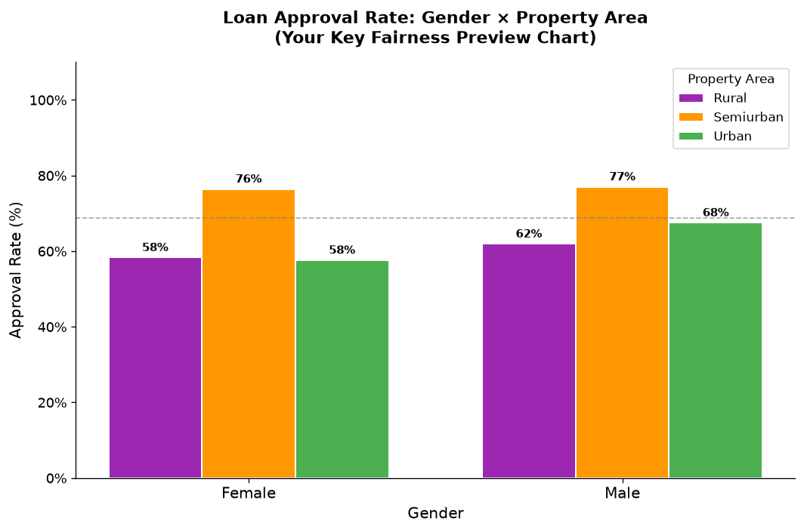
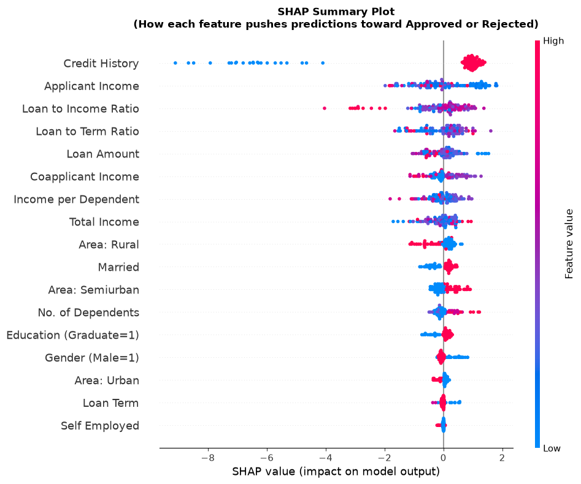
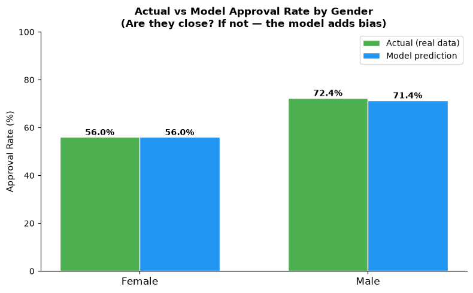
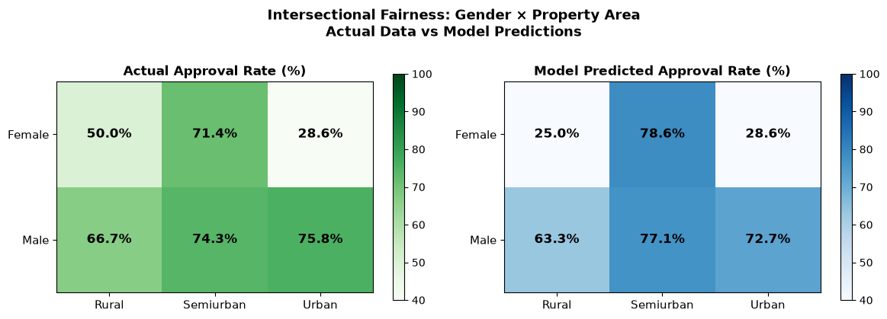
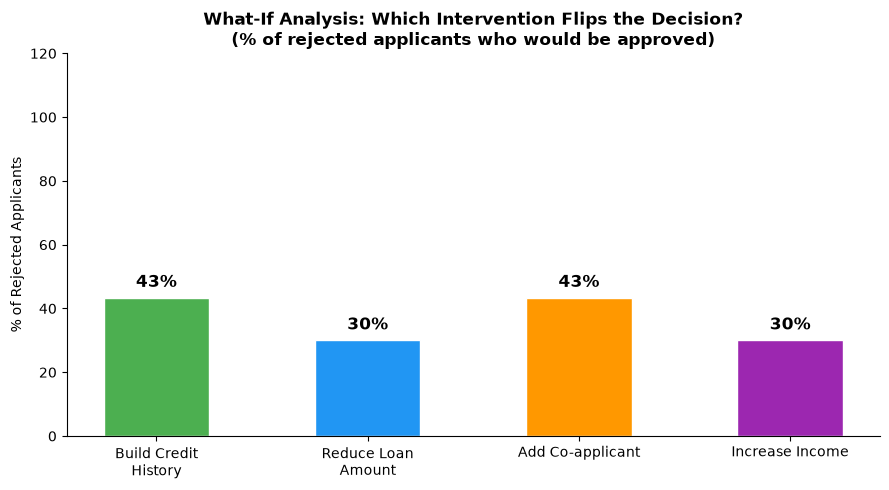
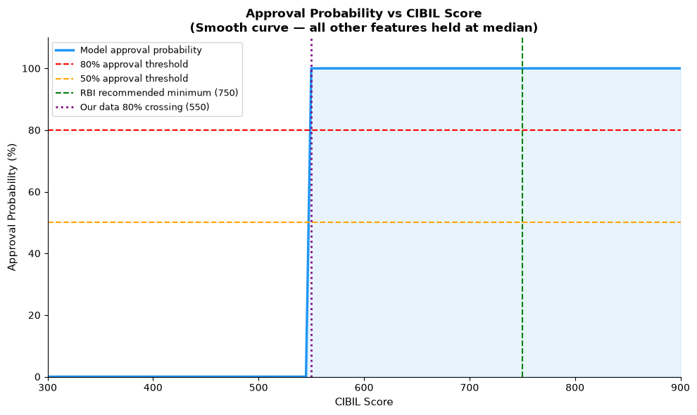
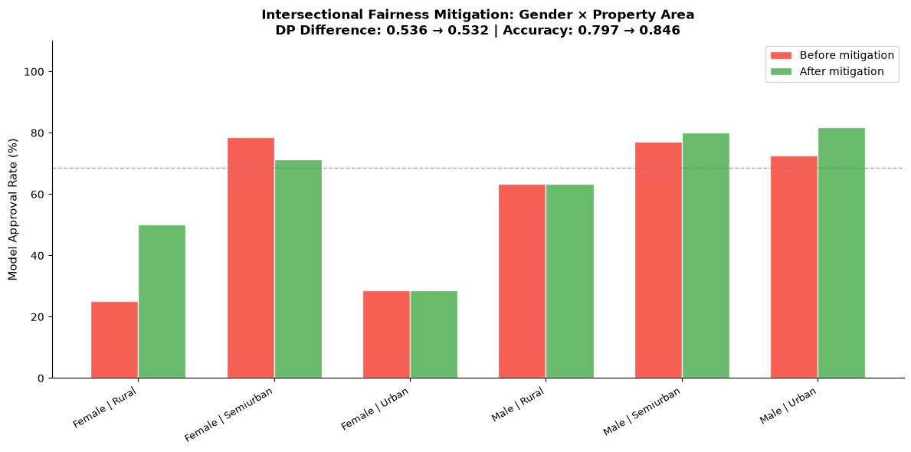

# Fair & Explainable Credit Risk Assessment
### Gender and Rural-Urban Analysis | Indian Home & Personal Loans

---

## What This Project Does

Banks use ML models to approve or reject loan applications — but these
models can treat certain groups unfairly without anyone realising it.

This project builds a complete, production-inspired credit risk pipeline:
1. **Predicts** loan approval risk for Indian applicants
2. **Explains** every decision using SHAP
3. **Audits** fairness across gender and rural/urban dimensions
4. **Mitigates** bias and documents the accuracy-fairness tradeoff
5. **Optimizes** maximum approvable loan for rejected applicants
6. **Validates** model stability using Population Stability Index
7. **Finds** CIBIL score inflection points aligned with RBI guidelines
8. **Translates** predictions into plain-language customer guidance via LLM

**Datasets:** Dream Housing Finance (home loans) + Indian Bank CIBIL
(personal loans) | 4,883 total applicants

---

## Key Results

| Metric | Home Loan Model | Personal Loan Model |
|--------|----------------|---------------------|
| Dataset | Dream Housing Finance | Indian Bank CIBIL |
| Rows | 614 | 4,269 |
| AUC-ROC | 0.8322 | 1.0000 |
| Accuracy | 79.7% | 99.6% |
| Top Feature | Credit History | CIBIL Score |

---

## Headline Findings

### 1. Intersectional Fairness Gap
| Group | Approval Rate |
|-------|--------------|
| 🔴 Female Rural | 25.0% |
| 🔴 Female Urban | 28.6% |
| 🟡 Male Rural | 63.3% |
| 🟢 Male Semiurban | 77.1% |
| 🟢 Female Semiurban | 78.6% |
| 🟢 Male Urban | 72.7% |

**52.1 percentage point gap** between Female Rural and Male Semiurban

### 2. Gap is Income-Driven, Not Model Bias
Model vs actual approval rate gap for females: **0.0pp**
The model accurately reflects real-world inequality — fixing the gap
requires addressing income inequality, not the model.

### 3. Rural Model Bias
Model is **5.9pp harsher** on rural applicants than actual data
justifies — genuine model bias identified and documented.

### 4. CIBIL Score Inflection Point
Approval probability jumps from **10% → 99%** at CIBIL band 550-600.
RBI recommends minimum 750 — our data suggests 550 is the real threshold.

### 5. What Rejected Applicants Need
- **43%** just need to build credit history
- **30%** just need to reduce loan amount by 18%
- **Average EMI ratio of rejected applicants: 792% of income**
- Average loan reduction needed: **66.5%**

### 6. PSI Model Stability
- Loan Amount PSI: 0.36 (⚠️ Unstable — needs monitoring)
- Income features: Stable ✅
- Overall: Model needs review on loan amount distribution

---

## Key Charts

### Approval Rate: Gender × Property Area

### SHAP Summary — What Drives Decisions

### Fairness: Actual vs Model by Gender

### Intersectional Heatmap

### What-If Interventions

### CIBIL Score Inflection

### Intersectional Mitigation

---

## Project Structure